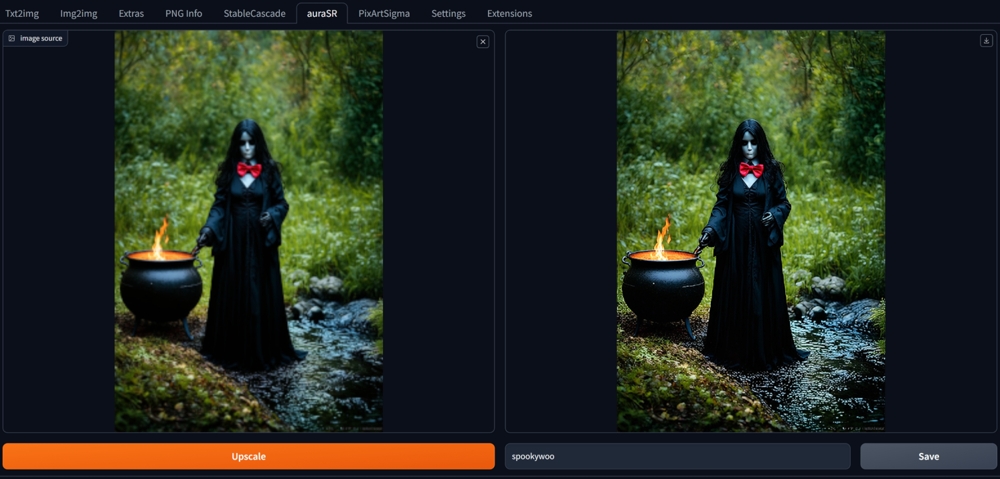

## auraSR (upscale) by **fal.ai** ##
## extension for webUIs for StableDiffusion: Automatic1111, Forge (old and new) ##

uses v2 which is much improved from the original release, though obvious artifacts are still possible depending on source. Results can be very good. This is a 4x upscale.

Save button by default writes to output/extras-images/{date} directory. Uses webUI settings, not hard-coded.

representative example using downsampled source (208x312):

